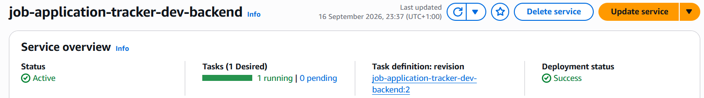
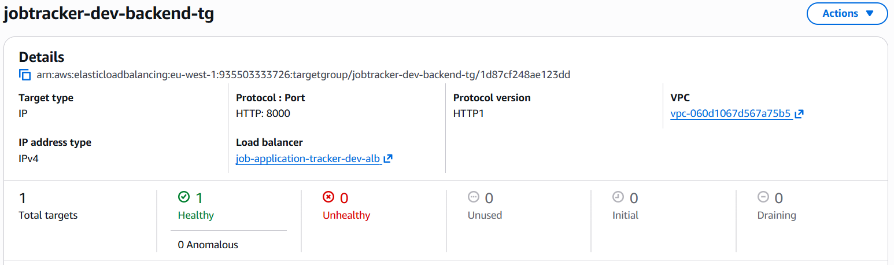
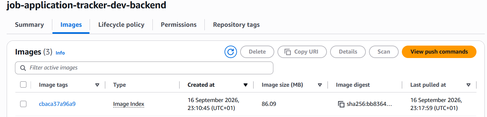
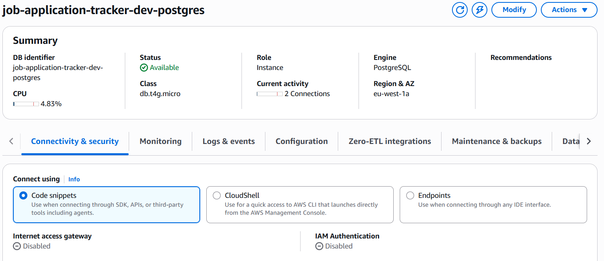
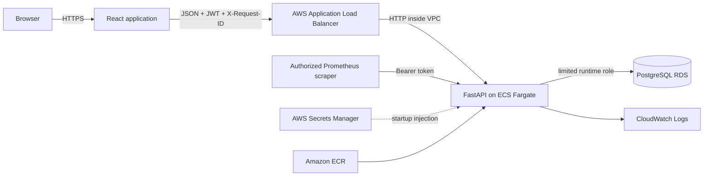
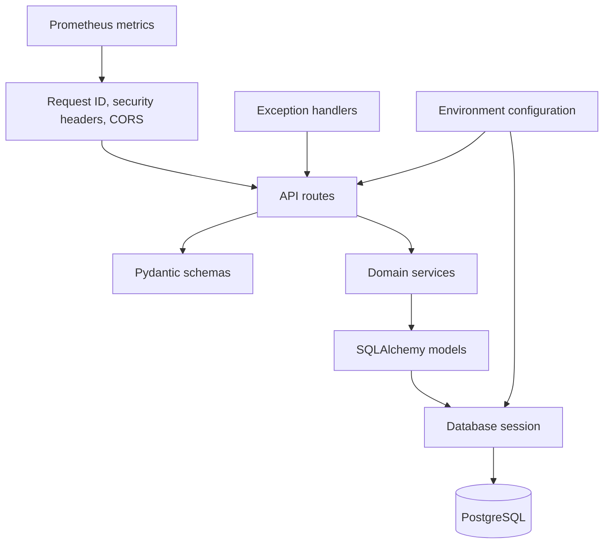

# Job Application Tracker

[](https://github.com/ricardoportoIE/job-application-tracker/actions/workflows/backend-ci.yml)
[](https://github.com/ricardoportoIE/job-application-tracker/actions/workflows/frontend-ci.yml)
[](https://github.com/ricardoportoIE/job-application-tracker/actions/workflows/terraform-ci.yml)
[](https://github.com/ricardoportoIE/job-application-tracker/actions/workflows/docker-ci.yml)

**Production-oriented full-stack platform for tracking job applications, companies, interviews and hiring pipelines — built to demonstrate backend engineering, cloud infrastructure, security, observability and software delivery practices.**

**Core stack:** Python 3.14 · FastAPI · React · TypeScript · PostgreSQL 17 · SQLAlchemy · Alembic · Docker · Terraform · AWS ECS Fargate · RDS · ECR · ALB · Route 53 · ACM · Secrets Manager · CloudWatch · Prometheus · GitHub Actions

---

## Why this project exists

Job Application Tracker is more than a CRUD portfolio application.

The goal was to design, build and validate a realistic production-style system that demonstrates the engineering concerns behind shipping software: authentication, data ownership, migrations, least privilege, container hardening, health checks, observability, immutable deployments, infrastructure as code, CI quality gates and controlled cloud cost.

The application lets users manage companies, job applications and hiring events while keeping every resource isolated to its owner.

The repository is intended as a technical case study for **Backend Engineer, Software Engineer, Cloud Engineer and DevOps-oriented roles**.

---

## Engineering highlights

- **Versioned FastAPI REST API** under `/api/v1`
- **JWT authentication** with Argon2 password hashing
- **Strict user-level resource isolation**
- **PostgreSQL 17** with SQLAlchemy and Alembic
- **Automatic serialized migrations** before API startup
- **Schema-aware readiness checks**
- **Separate administrative and runtime database roles**
- **Production container hardening**
  - non-root user
  - read-only root filesystem
  - dropped Linux capabilities
  - `no-new-privileges`
- **HTTPS-only AWS ingress** with ACM and Application Load Balancer
- **ECS Fargate tasks and RDS deployed in private subnets**
- **Immutable ECR image tags based on Git commit SHA**
- **AWS Secrets Manager** for application credentials
- **Structured JSON logging and request IDs**
- **Prometheus metrics with production bearer-token protection**
- **Four independent GitHub Actions quality gates**
- **Terraform-based infrastructure**
- **Architecture Decision Records documenting important trade-offs**
- **Temporary real AWS deployment validated end to end and destroyed after evidence capture to control cost**

---

## Production deployment — validated on AWS

The infrastructure was **actually deployed and tested in AWS `eu-west-1`**.

The temporary portfolio environment successfully validated:

```text
Cloudflare DNS
      |
      v
Route 53 delegated API zone
      |
      v
ACM certificate
      |
      v
HTTPS Application Load Balancer
      |
      v
ECS Fargate
      |
      v
FastAPI
      |
      v
Private PostgreSQL RDS
```

The deployed system reached the following validated state:

| Check                    | Result            |
| ------------------------ | ----------------- |
| ECS service              | `ACTIVE`          |
| Desired tasks            | `1`               |
| Running tasks            | `1`               |
| Pending tasks            | `0`               |
| Fargate container        | `RUNNING`         |
| ALB target health        | `healthy`         |
| `/ready`                 | HTTP `200`        |
| `/live`                  | HTTP `200`        |
| ECR deployment tag       | immutable Git SHA |
| RDS                      | `available`       |
| RDS publicly accessible  | `false`           |
| PostgreSQL               | 17                |
| End-to-end registration  | validated         |
| JWT login                | validated         |
| Company creation         | validated         |
| Job application creation | validated         |
| Terraform teardown       | completed         |

After validation and evidence capture, the AWS stack was destroyed with Terraform to avoid unnecessary ongoing portfolio costs.

### ECS service

The service reached a successful deployment with one desired and one running Fargate task.



### Load balancer health

The private ECS task registered successfully behind the Application Load Balancer and reached a healthy target state on port `8000`.



### Immutable ECR image

The backend image was published to Amazon ECR using an immutable Git commit SHA tag and was successfully pulled by ECS.



### Private PostgreSQL RDS

The application used PostgreSQL on Amazon RDS with private network access. The deployment validation confirmed `PubliclyAccessible = false`.



The complete CLI deployment snapshot is available in [`docs/evidence/aws-deployment-evidence.txt`](docs/evidence/aws-deployment-evidence.txt).

---

## Functional production validation

The deployed API was exercised over the real HTTPS endpoint.

A production validation flow successfully completed:

```text
register user
    |
    v
authenticate
    |
    v
receive JWT bearer token
    |
    v
create company
    |
    v
create job application
    |
    v
persist data in PostgreSQL RDS
```

Example validated application data:

```text
Position: Backend Engineer
Status:   applied
Location: Dublin, Ireland
Currency: EUR
```

This confirmed that the complete request path worked across DNS, TLS, ALB, ECS, FastAPI and PostgreSQL — not only in local development.

---

## System architecture



### AWS network boundary

```text
Internet
   |
   | HTTPS :443
   v
Application Load Balancer
   |
   | ECS security group :8000
   v
ECS Fargate
   |
   | RDS security group :5432
   v
PostgreSQL RDS
```

There is no direct public ingress to ECS or RDS.

For deeper architecture details, see:

- [System architecture](docs/architecture.md)
- [Database model](docs/database.md)
- [AWS deployment](docs/deployment.md)
- [Architecture Decision Records](docs/adr/README.md)
- [Terraform reference](infrastructure/README.md)

---

## Application capabilities

### Authentication

- User registration
- Login
- JWT bearer authentication
- Current-user endpoint
- Active-user enforcement
- Generic authentication failures to reduce information disclosure

### Companies

- Create company
- List companies
- Retrieve company
- Update company
- Delete company
- Ownership enforcement

### Applications

- Create and update job applications
- Delete applications
- Filter by status and company
- Search by relevant fields
- Sorting and pagination
- Salary range and currency
- Source and work model
- Application notes
- Applied-at timestamps

### Hiring timeline

- Application events
- Notes
- Interviews
- Offers
- Automatic timeline events
- Ownership checks across related resources

### Frontend

- Registration and login
- Pipeline summary
- Search and status filtering
- Company management
- Application creation and editing
- Application timeline
- Responsive desktop/mobile layout
- Loading, error, empty and success states

---

## Backend architecture



The backend uses synchronous SQLAlchemy sessions. Domain services own transaction boundaries and resource-ownership rules.

---

## Database model

Core entities:

```text
User
 |
 +-- Company
 |
 +-- Application
       |
       +-- ApplicationEvent
```

The database layer includes indexes for common user-scoped application queries, including combinations of:

```text
(user_id, created_at)
(user_id, status, created_at)
(user_id, company_id, created_at)
```

The schema is managed through Alembic migrations.

---

## Safe deployment startup

Production container startup follows this sequence:

```text
ECS task starts
      |
      v
connect using temporary admin credentials
      |
      v
acquire PostgreSQL advisory lock
      |
      v
create/update limited application role
      |
      v
apply Alembic migrations
      |
      v
verify expected schema head
      |
      v
grant runtime privileges
      |
      v
remove admin credentials from process environment
      |
      v
start Uvicorn using limited application credentials
```

This prevents the long-running API process from retaining database administrator privileges.

Readiness checks require both database connectivity and the expected migration head.

---

## Security model

### Authentication and application security

- Argon2 password hashing
- JWT `sub`, `iat` and `exp` claims
- Minimum production JWT secret length
- Resource access scoped to authenticated user ID
- Generic invalid-credential responses
- Inactive-user rejection
- Stable error responses

### HTTP security

- HTTPS-only public traffic
- HTTP → HTTPS redirect
- HSTS in production
- `X-Content-Type-Options`
- `X-Frame-Options`
- restrictive referrer policy
- controlled CORS
- `X-Request-ID` propagation

### Network security

- ALB is the only public application entry point
- ECS runs in private subnets
- RDS runs in private subnets
- ALB SG → ECS SG only
- ECS SG → RDS SG only
- RDS is not publicly accessible

### Secrets

AWS Secrets Manager is used for:

- JWT signing secret
- application database credentials
- metrics bearer token
- RDS-managed administrator credential

Terraform write-only secret inputs are ephemeral and are not intended to be stored in versioned `.tfvars` files.

---

## Observability

Every HTTP request receives an `X-Request-ID` that can be correlated with application logs.

Application logs are structured JSON.

Prometheus metrics include:

```text
http_requests_total
http_request_duration_seconds
database_health_failures_total
```

Production `/metrics` access requires a dedicated bearer token.

Route labels are normalized to avoid high-cardinality metric explosions from arbitrary URL paths.

---

## CI/CD quality gates

The repository uses four GitHub Actions workflows.

### Backend Quality Gate

Runs with PostgreSQL 17 and validates:

- dependency lock
- main database migrations
- Alembic model consistency
- test database migrations
- Ruff lint
- Ruff formatting
- MyPy
- complete pytest suite

### Frontend Quality Gate

Validates:

- locked `npm ci` install
- ESLint
- TypeScript production build
- Vite production bundle

### Terraform Quality Gate

Validates:

- Terraform formatting
- provider initialization
- Terraform configuration

### Application Images Gate

Builds both production images and validates:

- backend Docker image
- frontend Docker image
- Docker Compose configuration
- complete application stack startup
- backend readiness
- frontend availability
- authenticated-route behavior

---

## Local development

### Complete stack

Copy the environment template:

```bash
cp .env.example .env
```

Start PostgreSQL, backend and frontend:

```bash
docker compose up --build
```

Endpoints:

```text
Frontend:   http://localhost:5173
API:        http://localhost:8000/api/v1
Swagger:    http://localhost:8000/docs
Readiness:  http://localhost:8000/ready
Metrics:    http://localhost:8000/metrics
```

Stop the stack:

```bash
docker compose down
```

### Backend

Requirements:

- Python 3.14
- uv
- PostgreSQL 17

```bash
cd backend
uv sync --locked
uv run alembic upgrade head
uv run uvicorn app.main:app --reload
```

Quality checks:

```bash
uv run python -m ruff check .
uv run python -m ruff format --check .
uv run python -m mypy app
uv run python -m pytest
```

Tests require a dedicated `jobtracker_test` database. Safety checks reject the development database as a test target.

### Frontend

```bash
cd frontend
npm ci
npm run lint
npm run build
npm run dev
```

The development frontend proxies API requests to the backend.

---

## Docker

The backend production image uses a multi-stage Python build and runs as a non-root user.

The complete local stack uses:

```text
PostgreSQL
FastAPI backend
Nginx-served React frontend
```

The Docker CI workflow builds both production images and performs an integration smoke test against the running Compose stack.

---

## Infrastructure as Code

Terraform provisions:

- VPC
- two public subnets
- two private subnets
- Internet Gateway
- NAT Gateway
- route tables
- dedicated security groups
- Application Load Balancer
- HTTP → HTTPS redirect
- ACM certificate
- Route 53 API records
- ECS cluster
- Fargate task definition
- ECS service
- Amazon ECR
- private encrypted PostgreSQL RDS
- AWS Secrets Manager
- IAM execution role
- CloudWatch log group

Example validation:

```bash
cd infrastructure
terraform init
terraform fmt -check -recursive
terraform validate
terraform plan
```

Sensitive values are provided through environment variables rather than committed `.tfvars` files.

---

## Cost-aware cloud engineering

This project deliberately uses a **temporary deployment strategy**.

The goal is to prove a real production topology without pretending that a portfolio workload requires permanent infrastructure.

The validated environment intentionally used:

- one ECS task
- one NAT Gateway
- Single-AZ RDS
- `db.t4g.micro`
- short log retention

After validation and evidence capture, Terraform destroyed the environment.

A persistent production profile would revisit:

- multiple ECS tasks
- autoscaling
- Multi-AZ RDS
- one NAT Gateway per AZ or VPC endpoints
- longer backup retention
- deletion protection
- remote Terraform state and locking
- CloudWatch alarms and dashboards

---

## Architecture decisions

The repository includes ADRs for decisions such as:

| Decision                      | Engineering rationale                                    |
| ----------------------------- | -------------------------------------------------------- |
| Layered backend               | Separate HTTP concerns from domain logic and persistence |
| JWT bearer authentication     | Stateless API authentication                             |
| Serialized startup migrations | Prevent concurrent deployment migration races            |
| TLS termination at ALB        | Centralized public HTTPS boundary                        |
| Separate DB roles             | Least privilege for the long-running API                 |
| Immutable ECR image tags      | Deterministic deployments tied to source revision        |
| Private ECS/RDS networking    | Reduce public attack surface                             |
| Single NAT / Single-AZ RDS    | Explicit portfolio cost trade-off                        |

See [docs/adr/README.md](docs/adr/README.md).

---

## Repository structure

```text
.
|-- .github/
|   `-- workflows/          GitHub Actions quality gates
|-- backend/
|   |-- app/                FastAPI application
|   |-- migrations/         Alembic migrations
|   |-- scripts/            Production startup
|   `-- tests/              Backend automated tests
|-- frontend/               React + TypeScript application
|-- infrastructure/         Terraform AWS infrastructure
|-- docs/
|   |-- adr/                Architecture Decision Records
|   |-- evidence/           Real AWS deployment evidence
|   |-- architecture.md
|   |-- database.md
|   `-- deployment.md
|-- compose.yaml            Complete local container stack
|-- .env.example            Environment template
`-- README.md
```

---

## Known trade-offs

This repository documents rather than hides its current limitations:

- the portfolio AWS environment is intentionally not highly available
- JWT access tokens do not yet support refresh rotation or individual revocation
- application search uses escaped `ILIKE` rather than full-text/trigram indexing
- company and event listing are not yet paginated
- frontend automated browser coverage is still limited
- remote Terraform state is not yet configured
- autoscaling is not configured
- CloudWatch alarms/dashboards are not yet part of the Terraform stack
- no formal load-test baseline has been published yet

These are explicit engineering trade-offs, not claims of production completeness.

---

## Roadmap

- [x] User-isolated backend domain
- [x] Authentication and authorization
- [x] PostgreSQL persistence and Alembic migrations
- [x] Functional React MVP
- [x] Production Docker images
- [x] Automatic schema migration and verification
- [x] Structured observability
- [x] Protected low-cardinality metrics
- [x] Terraform AWS infrastructure
- [x] HTTPS AWS ingress
- [x] Private ECS Fargate deployment
- [x] Private PostgreSQL RDS
- [x] Immutable ECR deployment
- [x] Secrets Manager integration
- [x] Limited runtime database role
- [x] Backend, frontend, Terraform and Docker CI
- [x] Architecture, database, deployment and ADR documentation
- [x] Real AWS deployment validation
- [x] Deployment evidence captured
- [x] Cost-controlled Terraform teardown
- [ ] Frontend component and end-to-end tests
- [ ] Refresh-token rotation and revocation
- [ ] Remote Terraform state and locking
- [ ] ECS autoscaling and Multi-AZ production profile
- [ ] CloudWatch dashboards and alarms
- [ ] Performance and load-test evidence

---

## What this project demonstrates

For a recruiter or engineering manager, this repository provides evidence of practical experience across:

**Backend engineering**

- Python
- FastAPI
- REST API design
- authentication
- authorization
- SQLAlchemy
- PostgreSQL
- schema migrations
- testing
- error contracts

**Cloud engineering**

- AWS ECS Fargate
- RDS
- ECR
- ALB
- ACM
- Route 53
- VPC networking
- Secrets Manager
- IAM
- CloudWatch

**DevOps / delivery**

- Docker
- Docker Compose
- Terraform
- immutable deployments
- CI quality gates
- health/readiness checks
- deployment validation
- controlled teardown

**Engineering practices**

- least privilege
- defense in depth
- observability
- architecture documentation
- ADRs
- cost awareness
- explicit trade-offs
- reproducible environments

---

## Author

**Ricardo Porto**

GitHub: [github.com/ricardoportoIE](https://github.com/ricardoportoIE)

Built as part of a professional software engineering portfolio focused on backend, cloud and production engineering roles in Ireland and the UK.
