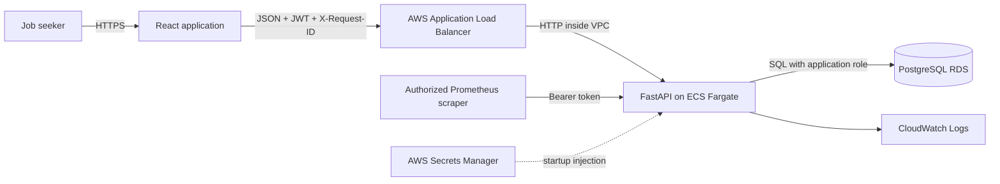
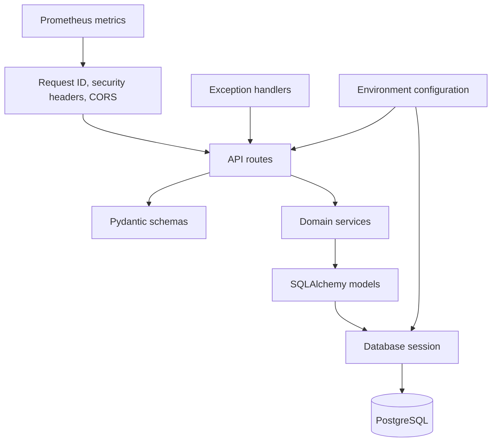

# System Architecture

## Context

Job Application Tracker is a browser application backed by a versioned HTTP API. Each authenticated user owns companies, applications, and application events. PostgreSQL is the system of record.

## Backend components

The backend uses synchronous SQLAlchemy sessions. FastAPI runs synchronous route functions in its worker thread pool. Services own transaction boundaries and resource-ownership checks.

## Request lifecycle

1. The browser adds a UUID `X-Request-ID` and, for authenticated requests, a bearer token.
2. CORS admits only configured origins and exposes the response request ID.
3. Request middleware validates or replaces the request ID, measures latency, and records a normalized route label.
4. Authentication resolves the user from the JWT subject and rejects missing, invalid, or inactive users.
5. Services scope every resource query by the current user's ID.
6. Errors use a stable JSON contract and include the request ID.

## Deployment invariants

- Public traffic is HTTPS-only; port 80 redirects to 443.
- ECS tasks and RDS are in private subnets.
- Only the ALB security group can reach ECS; only ECS can reach RDS.
- Container startup serializes migrations with a PostgreSQL advisory lock.
- Readiness requires both database connectivity and the expected Alembic head.
- The API process uses a limited database role. Administrative credentials exist only during the migration bootstrap and are removed before Uvicorn starts.
- Production metrics require a dedicated bearer token.

See [Database model](database.md), [Deployment](deployment.md), and the [architecture decisions](adr/README.md).
