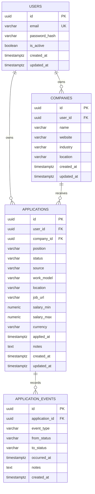

# Database Model

## Ownership and deletion

- Companies and applications belong directly to a user.
- Event ownership is inherited through the parent application.
- Deleting a user cascades to owned records.
- Deleting an application cascades to its events.
- A company referenced by an application cannot be deleted.

## Query indexes

Application listing uses compound indexes for the most common access paths:

- `(user_id, created_at)`
- `(user_id, status, created_at)`
- `(user_id, company_id, created_at)`

Pagination has a stable UUID tie-breaker. Free-text search uses escaped `ILIKE` expressions; trigram or full-text indexing can be introduced when measured data volume justifies it.

## Schema lifecycle

Alembic is the only schema-change mechanism. At startup, one container obtains a transaction-scoped advisory lock, upgrades to `head`, verifies the current database heads, grants the runtime role access to current and future objects, and only then starts the API.
