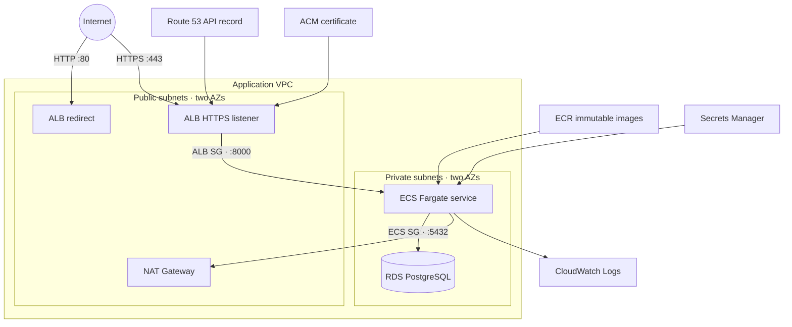
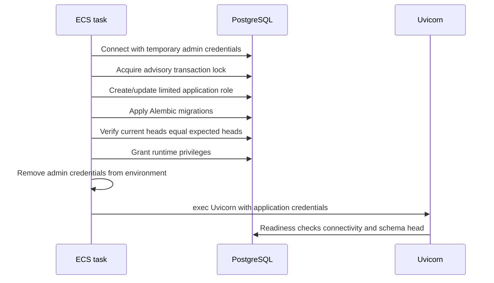

# AWS Deployment

## Container startup

## Required Terraform inputs

Non-secret inputs:

- `api_domain_name`
- `route53_zone_id`
- `frontend_origin` using HTTPS

Ephemeral sensitive inputs:

- `jwt_secret_value`
- `db_app_password`
- `metrics_bearer_token`

Pass sensitive values through `TF_VAR_...` environment variables or a secrets-aware CI system. Do not place them in `.tfvars` files.

Increment `secrets_version` whenever rotating one of the write-only values so Terraform creates the corresponding new secret versions.

## Availability and cost trade-offs

The portfolio environment runs one ECS task, one NAT Gateway, and Single-AZ RDS. It demonstrates the production topology but does not claim high availability. A persistent production environment should use at least two tasks, autoscaling, Multi-AZ RDS, one NAT Gateway per AZ or VPC endpoints, longer backups, deletion protection, alarms, and remote Terraform state with locking.
